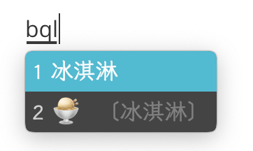
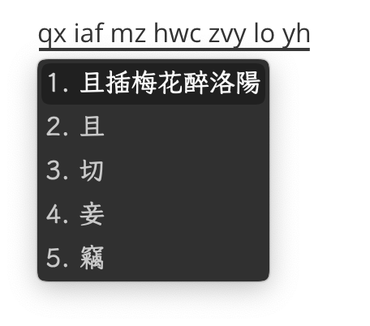

[English](README-en.md)

<h1 align="center">魔然 Rime 輸入方案</h1>

授權協議：方案主體依 [CC-BY 4.0](http://creativecommons.org/licenses/by/4.0/) 協議發佈，除非對應文件中另有說明。

---

配方： ℞ ksqsf/rime-moran ([線上試用](https://my-rime.vercel.app/?plum=ksqsf/rime-moran:moran,moran_sentence,moran_fixed))

本項目爲基於自然碼（雙拼和輔助碼）的傳承字優先的 Rime 方案，簡稱「魔然」。具有三種模式、五重反查、四萬字、百萬詞庫和多種快捷輸入功能。詳情請參閱[本項目維基](https://github.com/ksqsf/rime-moran/wiki)。

魔然是開放的、社區維護的項目。歡迎參與！

- [用法](https://github.com/ksqsf/rime-moran/wiki/%E6%95%99%E7%A8%8B#%E5%85%B6%E4%B8%89%E6%9B%B0%E5%96%AE%E5%AD%97%E8%BC%B8%E5%85%A5%E6%96%B9%E5%BC%8F)
- [說明書](https://github.com/ksqsf/rime-moran/wiki)
- [常見問題](https://github.com/ksqsf/rime-moran/wiki/%E5%B8%B8%E8%A6%8B%E5%95%8F%E9%A1%8C)
- [下載簡體版](https://github.com/ksqsf/rime-moran/wiki/%E7%AE%80%E4%BD%93%E7%89%88)

| 簡快碼                              | 整句輔助                                 |
|-------------------------------------|------------------------------------------|
|  |  |

## 鳴謝

+ Rime 項目所發佈的高品質輸入法程序和詞庫
+ 自然碼原始碼表：[rime-zrm](https://github.com/bigshans/rime-zrm)
+ 部分 Lua 腳本：[秃版虎碼 Rime 方案](https://tiger-code.com/)
+ 皮膚：[ssnhd/Rime](https://github.com/ssnhd/rime/)、[KyleBing/rime-wubi86-jidian](https://github.com/KyleBing/rime-wubi86-jidian/)、秃版虎码方案和零星收集等
+ 其他詞庫：在詞庫文件中標出，特別感謝呂奉先優化製作的簡體優先詞庫

本方案的製作還得到了铁圈、䑝曻、蹄垫的幫助，在此表示感謝。
